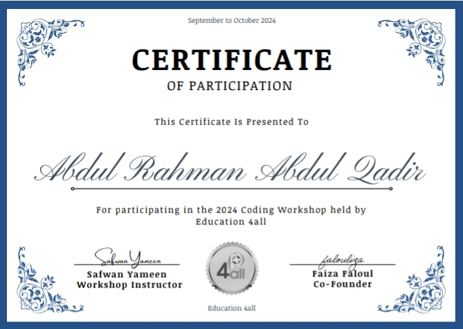

<!--
  ================================
        COLORFUL GITHUB PROFILE
  ================================
  Save this file as `README.md` in the repository named exactly the same as your GitHub username.
  Make sure `abdulrahman_moving.gif` is in the same folder as this README.
-->

  
  <h1 style="color:#61DAFB;">Hello, I’m AbdulRahman</h1>
  
Django Backend Developer |📚 Always Learning

<strong> Descriptions <strong/>
---
My name is Abdulrahman. I have been learning Python for about a year and a half and feel comfortable using it, Alhamdulillah. I have hands-on experience with Django through various projects and am eager to deepen my understanding of it further. 

While I haven’t started freelancing yet, I’m planning to explore this path soon. I am good in HTML and CSS from extensive practical use, especially HTML, and am working to improve my JavaScript skills later. I have not yet worked with APIs in my projects, so that’s an area I’m aiming to learn soon.

Familiar skills⬇️

**Skills** 

- **Languages & Frameworks:** Python, Django, HTML, CSS
- **Database:** MySQL
- **Tools:** AI, Git & GitHub
- **Django Concepts:**
  - Authentication
  - Permissions
  - ORM (Object Relational Mapping)
  - Views & Models
  - Static Files Management
  - URL Routing
  - Django Template Language
- **Soft Skills:** Problem-solving
- 
  ## 📜 Here is my certificate:

## 🛠️ Skills

  <!-- Custom “Py | Python” badge -->
  
  <!-- Custom “My | MySQL” badge -->
  
  <!-- HTML5 badge -->
  
  <!-- CSS3 badge -->
  
  <!-- Django badge -->
  
  <!-- Git badge -->
  

---

## Featured Projects

  <a href="https://github.com/<your-username>/django-blog-api">
    
  </a>
   
  comming soon

  <a href="https://github.com/<your-username>/invoice-manager">
    
  </a>
   
  comming soon

  
   
  Backend for an e-commerce site using Django and Python. Implements product catalog, shopping cart, orders, and register. order comming soon.

---

## 📫 Let’s Connect

  
  <a href="https://linkedin.com/in/<your-linkedin>">
    -0A66C2?style=for-the-badge&logo=linkedin&logoColor=white" alt="LinkedIn" />
  </a>
  <a href="https://twitter.com/<your-twitter-handle>">
    -1DA1F2?style=for-the-badge&logo=twitter&logoColor=white" alt="Twitter" />
  </a>
  <a href="https://github.com/<your-username>">
    -181717?style=for-the-badge&logo=github&logoColor=white" alt="GitHub" />
  </a>

---

  Made with using Python & Django

